# Android UI reference pack

**Reference pack revision:** 3.4.4 (tracks Android UI specification 3.4.5)
**Last verified:** 2026-09-25
**Reference release baseline:** Apple marketing version 1.1 — 17 September 2026

This pack separates evidence from the Android presentation contract:

- Shared product behavior comes from the [Ripple PRD](../../Ripple_PRD.md), especially Section 22.
- Platform-independent surface behavior comes from the [Ripple screen and sheet catalog](../../Ripple_SCREEN_CATALOG.md).
- Shared tokens and reusable UI contracts come from the [Ripple design system](../../Ripple_DESIGN_SYSTEM.md).
- Fields, invariants, and source-of-truth boundaries come from the [Ripple data model](../../Ripple_DATA_MODEL.md).
- Android screen behavior comes from the [Android UI specification](../ANDROID_UI_SPEC.md) and architecture from the [Android architecture guide](../ANDROID_ARCHITECTURE.md).
- The iOS mapping is documented in the [iOS architecture reference](../../IOS_ARCHITECTURE.md).
- Evidence classification and product-owned visible-element coverage come from the [Ripple visual reference inventory](../../Ripple_VISUAL_REFERENCE_INVENTORY.md).

- The existing iOS PNGs are evidence of the current product hierarchy and visual priorities.
- The PNGs in this directory are authored Android layout illustrations, not
  emulator/device captures. The text contracts define Android-native controls
  and responsive behavior; the illustrations suggest composition but never
  override the shared semantic contracts.
- Real Android emulator and Wear captures are not present in this handoff pack.
  They remain final acceptance artifacts in the independent Android project;
  these illustrations do not replace runtime verification.

## Shared semantic wireframes

The 22 canonical surfaces also have platform-independent PNG previews and
same-stem editable SVG sources in
[`../../wireframes/README.md`](../../wireframes/README.md). The [shared screen
catalog](../../Ripple_SCREEN_CATALOG.md) links each primary image. Those
wireframes are the neutral layout contract; the PNGs in this Android pack are
Android-specific layout illustrations and may suggest native density,
controls, and navigation. Neither image set proves runtime behavior.
The [visual reference inventory](../../Ripple_VISUAL_REFERENCE_INVENTORY.md)
is the full audit of what each reference shows, what is cropped or
system-owned, and which product-owned elements the shared wireframe must
retain.

## Resize/fold reference update

This revision keeps the shared neutral [Today adaptive](../../wireframes/today--resize--adaptive.png)
and [History adaptive](../../wireframes/history--resize--adaptive.png) illustrations.
Their editable sources and rendering instructions live in the shared wireframe
pack. The iPhone Duo outer-display Today capture verifies the compact ready
state only; iOS images remain implementation evidence and Android images remain
illustrative layout targets. The visual inventory and corrected shared wireframes now make
the History add action, Stats chart families/Highlights, Settings group
separation, Day Detail actions, Edit Container delete, and seven Wear History
days explicit. No static image demonstrates live resize, active-fold
arrangement, or selection/draft retention, and no Android runtime captures
were produced. Validate those behaviors against the current 3.4.5 UI specification
before adding runtime evidence. Historical image provenance remains intact.

## iOS evidence

- [iPhone Today](../../screens/ios/iphone-today.png)
- [iPhone Duo Today, outer display](../../screens/ios/iphone-duo-today-outer.png)
- [iPhone History](../../screens/ios/iphone-history.png)
- [iPhone Stats](../../screens/ios/iphone-stats.png)
- [iPad Settings](../../screens/ios/ipad-settings.png)
- [Watch Today](../../screens/ios/watch-today.png)
- [Watch History](../../screens/ios/watch-history.png)
- [Watch Stats](../../screens/ios/watch-stats.png)

## Source-platform routing note

The latest iOS implementation centralizes iOS root selection and selected
presentations in `RippleNavigationCoordinator`. This is source-platform
context only; it does not change the Android illustrations or shared surface
composition. Android keeps its own native typed destinations, adaptive root
navigation, and predictive-back behavior, and must not port the Swift route
owner.

## Android layout illustrations

Every image below is an authored layout illustration rather than a runtime
capture. The shared surface contracts define product meaning; Android UI
guidance defines native interaction. Editable SVG sources are linked for the
illustrations revised with this reference pack.

| Reference | Contract |
|---|---|
| [`phone-today.png`](phone-today.png) ([source](phone-today.svg)) | Four-root phone shell; recognizable tapered 2D tumbler glass with water clipped to its inner path, upright/flat idle surface matching the 62% readout, and the existing device-tilt behavior defined in the Android UI contract; first three ordered saved-container quick adds; custom amount; layout-neutral confirmation; no Recent list |
| [`phone-history.png`](phone-history.png) ([source](phone-history.svg)) | Horizontal month pager; all dates in a seven-column month grid; one capped ring per day; today-only add; future days disabled |
| `phone-day-detail.png` | Nested Day Detail; localized weekday/date top-app-bar title without a duplicate compact content heading, static contained glass/readout summary, goal and remaining status, intake rows, edit/delete/restore, add only for today; today's add confirms with a transient toast and delete uses a transient Snackbar action for Undo |
| [`phone-stats.png`](phone-stats.png) ([source](phone-stats.svg)) | Period selector and dependent range row; average, goal hits, total; actual-vs-goal, goal-rate, four-bucket daypart, and container-distribution charts; separate Highlights |
| `phone-settings.png` | Profile, goal, containers, reminders, Health, sync, export, about |
| `phone-onboarding.png` | Six onboarding pages and native permission handoffs |
| [`tablet-history-split.png`](tablet-history-split.png) ([source](tablet-history-split.svg)) | Expanded History with all dates in seven columns; selected-today detail with a contained static glass, matching entry total, and today-only add |
| [`tablet-stats.png`](tablet-stats.png) ([source](tablet-stats.svg)) | Expanded Stats with persistent navigation, three required summary metrics, four distinct chart families, and separate Highlights |
| [`wear-today.png`](wear-today.png) ([source](wear-today.svg)) | Flat full-canvas field proportional to the 88% readout, complete goal context, and one `+` entry point to amount selection |
| [`wear-history.png`](wear-history.png) ([source](wear-history.svg)) | Seven elapsed local days; Wear-native list |
| [`wear-day-detail.png`](wear-day-detail.png) ([source](wear-day-detail.svg)) | Date and summary; chronological rows with time/amount/container/source; row-level soft delete and transient Undo |
| [`wear-stats.png`](wear-stats.png) ([source](wear-stats.svg)) | Current ISO-week context; average/day, goal hits, total, and one compact chart |

## Stable surface IDs and evidence map

Stable IDs are defined once in [`Ripple_SCREEN_CATALOG.md`](../../Ripple_SCREEN_CATALOG.md),
and each ID has one canonical platform-independent description under
[`../../screens/`](../../screens/). The images below illustrate the listed
surfaces; they do not establish runtime behavior, create new screens, or change
the canonical description-file rule. The complete state/viewport/crop/chrome and
product-owned visible-element review is maintained in the [visual reference
inventory](../../Ripple_VISUAL_REFERENCE_INVENTORY.md).

| Stable ID | Android illustration(s) | Coverage role; not runtime proof |
|---|---|---|
| `today` | `phone-today.png` | Compact ready-state hierarchy, recognizable tapered tumbler silhouette, flat idle water clipped to the glass and proportional to the readout, ordered quick adds, and full-width custom action; dynamic tilt is text-contract behavior. |
| `history` | `phone-history.png`, `tablet-history-split.png` | Complete compact and expanded month grids with today-only add, plus expanded calendar/detail context. |
| `day-detail` | `phone-day-detail.png`, `tablet-history-split.png` | Static contained-glass summary, selected date, entries matching the total, and responsive detail placement. |
| `stats` | `phone-stats.png`, `tablet-stats.png` | Period plus range context, three summaries, four distinct chart families, and separate Highlights. |
| `settings` | `phone-settings.png` | Settings groups, native-control placement, and container ordering context. |
| `onboarding` | `phone-onboarding.png` | Six-page flow and native permission handoff context. |
| `watch-today` | `wear-today.png` | Proportional flat-field readout and one entry point to amount selection. |
| `watch-history` | `wear-history.png` | Seven elapsed local days. |
| `watch-day-detail` | `wear-day-detail.png` | Wear entry detail with time/amount/container/source and row-level delete/Undo. |
| `watch-stats` | `wear-stats.png` | Current ISO-week average, goal hits, total, and one compact chart. |
| `custom-amount`, `edit-intake`, `add-container`, `edit-container`, `edit-reminder`, `widget`, `quick-log-control`, `notification-actions`, `shortcuts-and-intents`, `complication`, `share-export` | No static image in this pack | Behavior is defined by the shared catalog and Android UI/architecture documents; add a capture only when it materially improves acceptance coverage. |

## Layout previews

These images are visual layout references for the Android port. They show
information hierarchy and responsive composition; native Android control
placement remains specified in the UI contract. They are not runtime captures,
pixel targets for iOS, or a request to reproduce iOS chrome.

### Phone

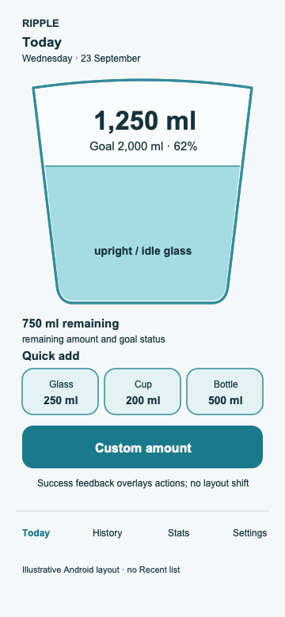

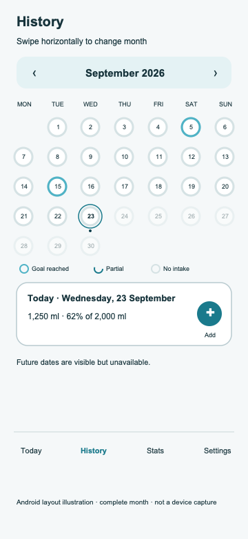

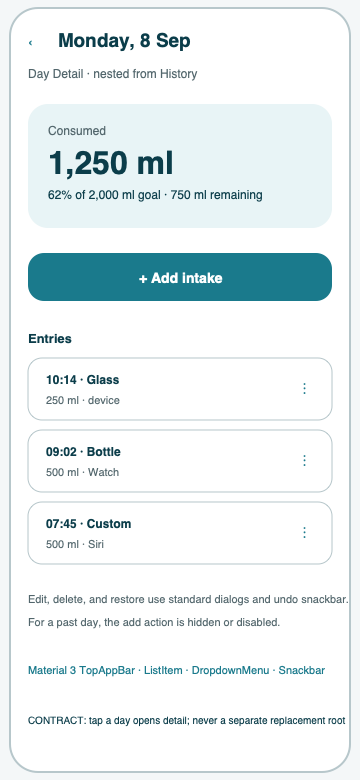

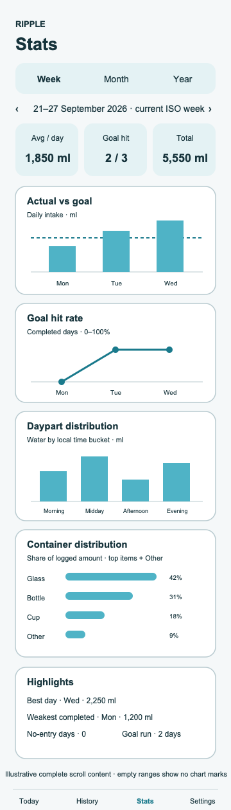

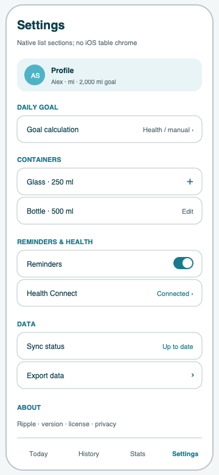

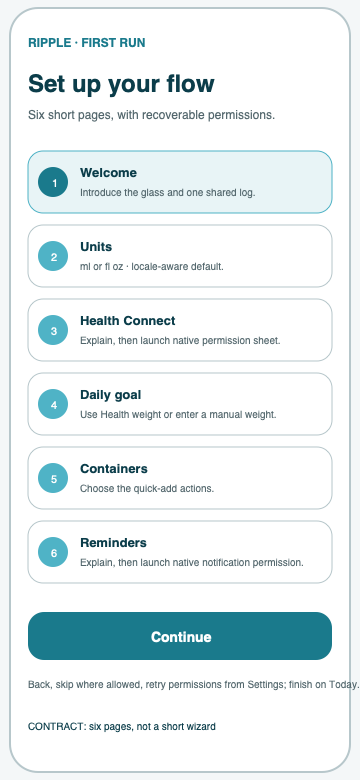

### Tablet

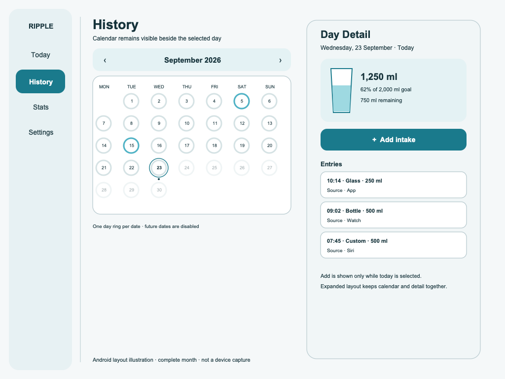

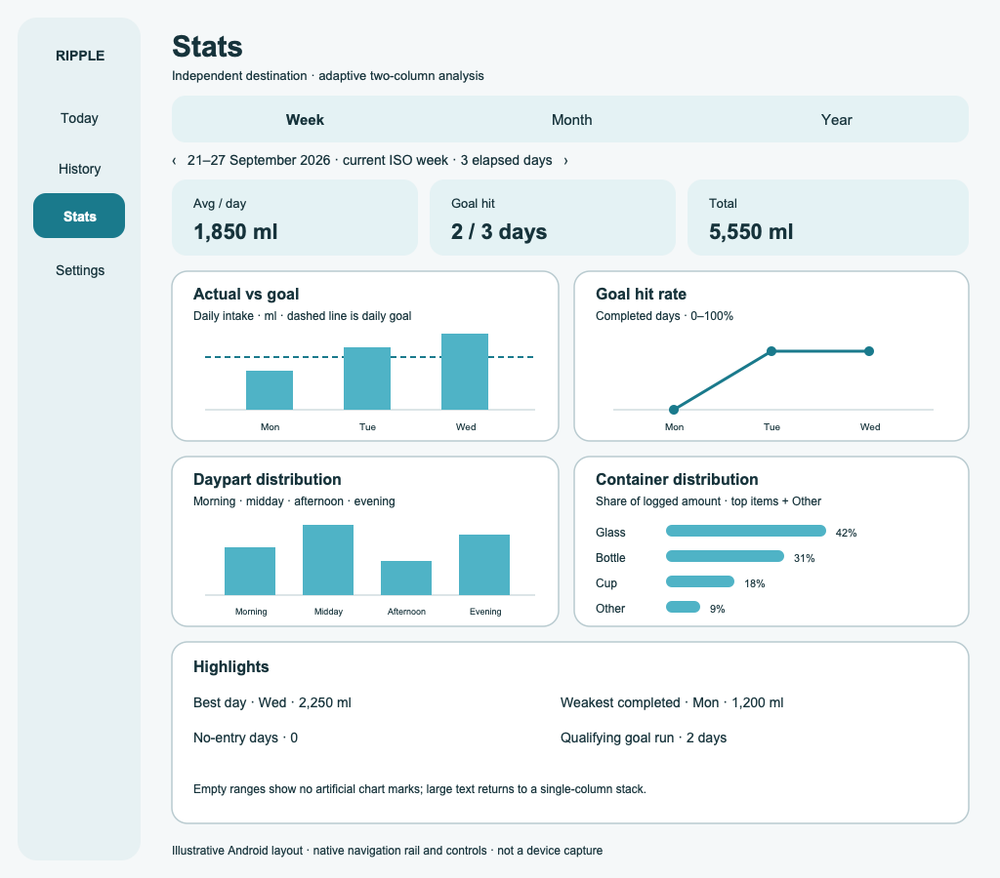

### Wear OS

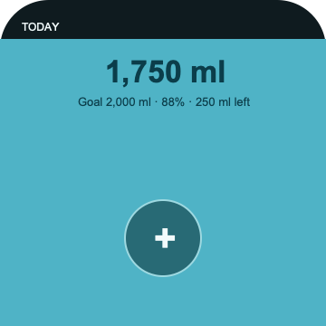

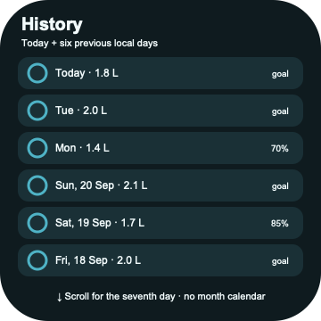

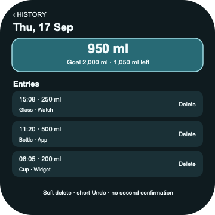

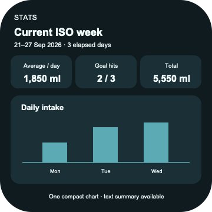

The pack contains documentation only. The Day Detail summary region is the
structural reference for the static contained glass/readout; its exact geometry,
side-inset rule, and accessibility behavior are normative in
`ANDROID_UI_SPEC.md` §5.2 and §10. The pack does not authorize copying Liquid
Glass, an iOS tab bar, or iOS navigation chrome into Android. Android uses
Material 3, Window Size Classes, standard Android permission surfaces, and
Wear-native navigation while preserving the same screens, information
priority, and flows.

The static `phone-today.png` illustration intentionally shows the upright/idle
ready state without transient feedback. Its tapered 2D tumbler silhouette and
clipped water fill are product-owned geometry, while tilt/slosh is dynamic
behavior defined by the Android UI specification. It is a seeded baseline with
three quick-add actions. At
runtime, Today shows the first three saved containers sharing the full width of
a fixed, non-scrolling row in Settings order, while the custom amount sheet places a slider before its
wider, unlabeled selection of every saved container. After a completed log, Android Today and Wear Today present
the localized confirmation as a centered or content-anchored Snackbar/Toast
overlay above the lower actions; it never changes the measured hero or quick-add
layout. Today's Day Detail add uses the same localized transient confirmation;
Day Detail delete uses the same transient surface with an Undo action.
Sync, permission, loading, and unresolved errors remain in their inline state
surfaces until resolved or retried. The Wear Today illustration shows the
single entry point; its separate amount-sheet contract owns the three presets,
rotary adjustment, and explicit log confirmation.

## Visual audit

Every canonical surface has a shared PNG/SVG pair, and the inventory maps all
22 IDs to inspected iOS implementation evidence, Android layout illustrations,
or records when no runtime capture exists. Cropped captures are labeled as partial evidence rather than
being treated as complete composition. Shared wireframes preserve the
product-owned regions that may be missing from a crop: Stats has four chart
families plus Highlights, Settings has eight groups, History has a today-only
add action, Day Detail exposes goal and row actions, Edit Container exposes
Delete, and Wear History shows seven elapsed local days. Android resize/fold
runtime proof remains pending.

## Reference-pack maintenance and revision history

Update this index and the affected image references in the same change when a
screen contract, state, layout breakpoint, design token, or acceptance capture
changes. Keep image filenames stable when the semantic surface is unchanged;
replace an image only when it no longer represents the current reference state.
Every revision updates the header, `Last verified`, the stable-ID map, and the
Android UI specification's immutable timeline entry. An image is never a
substitute for the PRD, screen catalog, design system, or data model.

| Revision | Date | Change | Impact |
|---|---|---|---|
| 3.0.0 | 2026-09-11 | Synchronized the reference pack with Android UI specification 3.0.0 and added links to the shared screen, design, and data contracts plus stable-ID evidence mapping. | Reference images are traceable to semantic surfaces and remain evidence rather than a competing source of truth. |
| 3.1.0 | 2026-09-11 | Linked the reference pack to the one canonical description file for each surface and clarified that the rule applies to documentation, not Android source-file organization. | Evidence, Android-native UI guidance, and platform-independent screen descriptions now have an explicit one-to-one map without prescribing a Kotlin file structure. |
| 3.2.0 | 2026-09-18 | Recorded the Apple 1.1 baseline and linked the complete shared semantic wireframe pack while preserving this directory as Android evidence only. | Android implementers can distinguish the portable cross-platform layout contract from native runtime captures during finalization and acceptance review. |
| 3.3.0 | 2026-09-19 | Linked new neutral responsive Today/History illustrations and added an iPhone Duo outer-display Today capture while keeping active-fold evidence explicitly pending. | The Android handoff remains current without treating a compact ready-state capture as proof of live resizing or fold behavior. |
| 3.3.1 | 2026-09-20 | Recorded the adaptive Stats/Settings panel rule without changing the existing evidence images. | Android implementers have current cross-platform responsive guidance while the reference captures remain stable baseline evidence. |
| 3.4.0 | 2026-09-23 | Audited the complete evidence set against the shared visual inventory and updated the shared wireframe coverage while preserving Android-native evidence and known runtime gaps. | The reference pack now makes every product-owned visible region traceable without turning cropped images or native chrome into competing product contracts. |
| 3.4.1 | 2026-09-23 | Rebuilt Android Stats and Wear layout illustrations against the canonical chart, summary, logging, and delete/Undo contracts; clarified that PNGs are illustrations, not device captures. | Android reviewers can see the complete required compositions while runtime build/device acceptance remains clearly deferred to the separate Android repository. |
| 3.4.2 | 2026-09-23 | Rebuilt the Android phone/tablet History illustrations with every date in seven columns, today-only add, disabled future dates, and matching Day Detail totals; corrected the Wear Today fill ratio and linked editable sources. | The references now show complete calendar surfaces and proportional/consistent sample values, while remaining authored illustrations rather than runtime evidence. |
| 3.4.3 | 2026-09-24 | Recorded the iOS-only composition-root routing change as implementation context without changing Android layout illustrations or shared visual evidence. | The reference pack makes the source-platform boundary explicit while preserving the current images, stable-ID map, and Android-native navigation responsibility. |
| 3.4.4 | 2026-09-25 | Replaced the incomplete rounded-rectangle Android Today hero with the recognizable tapered 2D tumbler silhouette and clipped/widening water fill; documented upright/idle illustration versus dynamic tilt behavior. | Android reviewers can inspect the product-owned glass form in the layout reference without treating the static image as runtime motion proof. |
